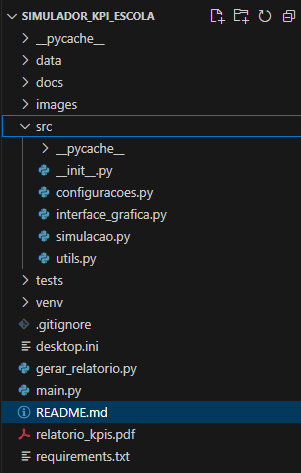
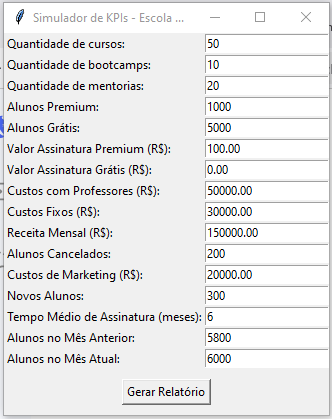
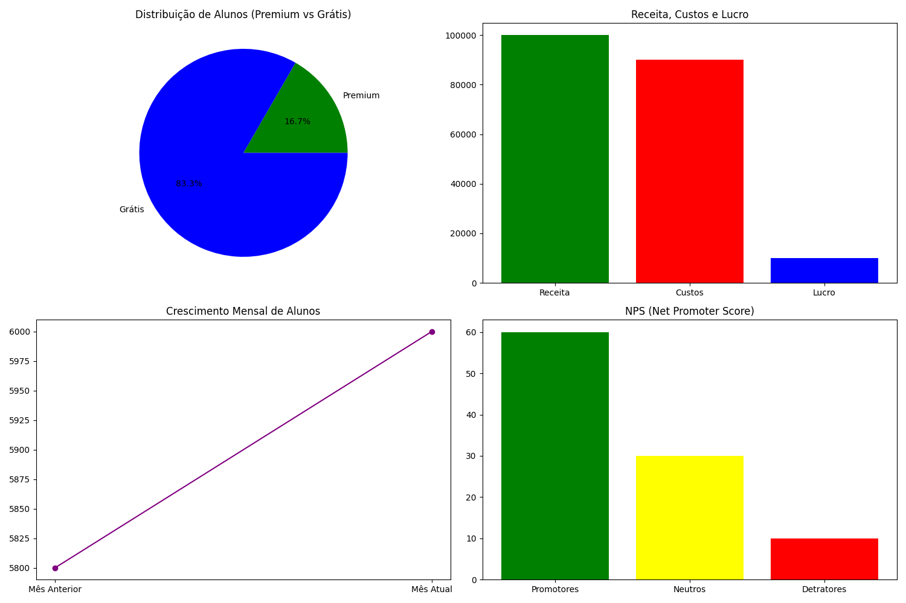
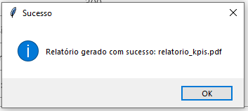

# **Contexto do Projeto: 🚀 Simulador de KPIs para Escola Online**

## **1. Nome do Projeto** 🏫

- **Simulador de KPIs para Escola Online**: Um projeto que simula e calcula métricas de desempenho (KPIs) para uma escola que oferece cursos, mentorias e bootcamps online.

## **2. O Que o Projeto Faz?** 🤔

- O projeto permite que o usuário insira dados como quantidade de alunos, custos, receitas e outros valores relacionados à operação da escola.
- Com base nesses dados, o sistema calcula **KPIs** (Key Performance Indicators), como lucro, margem de lucro, taxa de conversão, Churn Rate, LTV, CAC, entre outros.
- Por fim, gera um **relatório em PDF** com os resultados e gráficos para facilitar a análise.

## **3. Objetivos do Projeto** 🎯

- **Simular cenários**: Permitir que o usuário simule diferentes situações de negócio.
- **Calcular KPIs**: Fornecer métricas de desempenho para avaliar a saúde financeira da escola.
- **Gerar relatórios**: Criar um relatório completo em PDF com os resultados e gráficos.
- **Facilitar a tomada de decisão**: Ajudar gestores a entenderem o desempenho da escola e identificar oportunidades de melhoria.

## **4. Tecnologia Utilizada** 🛠️

- **Linguagem de Programação**: Python.
- **Bibliotecas**:
  - `tkinter`: Para criar a interface gráfica onde o usuário insere os dados.
  - `matplotlib`: Para gerar gráficos visuais.
  - `fpdf`: Para criar o relatório em PDF.
  - `locale`: Para formatar os valores no padrão brasileiro (R$).

## **5. Estrutura do Projeto** 📂

O projeto é dividido em **quatro arquivos Python**, cada um com uma função específica:

1. **`simulacao.py`**:
   - **O que faz**: Contém a lógica para calcular as KPIs.
   - **Função principal**: `calcular_kpis` recebe os dados de entrada e retorna um dicionário com todas as métricas calculadas.

2. **`interface_grafica.py`**:
   - **O que faz**: Cria uma interface gráfica para o usuário inserir os dados.
   - **Função principal**: `coletar_dados` coleta os valores inseridos pelo usuário e os passa para a função `calcular_kpis`.

3. **`gerar_relatorio.py`**:
   - **O que faz**: Gera o relatório em PDF com os resultados e gráficos.
   - **Função principal**: `gerar_relatorio_pdf` recebe os KPIs calculados e cria um PDF com as métricas e gráficos.

4. **`main.py`**:
   - **O que faz**: É o ponto de entrada do programa.
   - **Função principal**: Chama a função `coletar_dados` do arquivo `interface_grafica.py` para iniciar o programa.

## **6. Como os Arquivos se Relacionam?** 🔗

- O **`main.py`** inicia o programa chamando a função `coletar_dados` do **`interface_grafica.py`**.
- A interface gráfica coleta os dados do usuário e os passa para a função `calcular_kpis` do **`simulacao.py`**.
- Os KPIs calculados são enviados para a função `gerar_relatorio_pdf` do **`gerar_relatorio.py`**, que gera o relatório em PDF.
- O relatório é salvo como **`relatorio_kpis.pdf`** na mesma pasta do projeto.

## **7. Quem Faz o Quê?** 🤹

- **`simulacao.py`**: Faz os cálculos das KPIs.
- **`interface_grafica.py`**: Coleta os dados do usuário.
- **`gerar_relatorio.py`**: Gera o relatório em PDF.
- **`main.py`**: Inicia o programa e coordena a execução dos outros arquivos.

## **8. Como o Script `main.py` é Chamado?** 🖥️

- O script **`main.py`** é executado diretamente no terminal ou no ambiente de desenvolvimento (como o VSCode).
- Comando no terminal:

  python main.py

- Ao ser executado, ele chama a interface gráfica para coletar os dados do usuário.

## **9. Quais Variáveis o Analista Deve Inserir?** 📝

O analista deve inserir os seguintes dados na interface gráfica:

- Quantidade de cursos, bootcamps e mentorias.
- Número de alunos premium e grátis.
- Valor das assinaturas premium e grátis.
- Custos com professores, custos fixos e custos de marketing.
- Receita mensal.
- Número de alunos cancelados.
- Número de novos alunos.
- Tempo médio de assinatura.
- Número de alunos no mês anterior e no mês atual.

## **10. Resultados no Relatório em PDF** 📊

O relatório em PDF contém:

- **KPIs Calculados**: Lucro, margem de lucro, taxa de conversão, Churn Rate, LTV, CAC, ROI, etc.
- **Gráficos**:
  - Distribuição de alunos (Premium vs Grátis).
  - Comparação de receita, custos e lucro.
  - Crescimento mensal de alunos.
  - NPS (Net Promoter Score).
- **Anexo**: Explicações detalhadas das fórmulas e análise dos resultados.

## **11. Conclusão do Projeto** ✅

- O script em Python foi **eficaz** ao retornar resultados condizentes com a teoria dos KPIs.
- O projeto demonstra como a programação pode ser aplicada para resolver problemas reais, como a análise de desempenho de uma escola online.
- A estrutura modular (com quatro arquivos) facilita a manutenção e a expansão do projeto.
- O relatório em PDF, com gráficos e explicações, é uma ferramenta poderosa para a tomada de decisões.

## **12. Resumo Final** 📜

O **Simulador de KPIs para Escola Online** é um projeto prático e didático que utiliza Python para calcular métricas de desempenho e gerar relatórios completos. Ele é ideal para iniciantes em programação que desejam entender como a tecnologia pode ser aplicada em contextos reais, como a gestão de negócios. Com uma interface gráfica simples e um relatório detalhado, o projeto é uma excelente ferramenta para análise e tomada de decisões. 🚀

## **13. Contribuição** 🤝

Sua colaboração é sempre bem-vinda! Se quiser contribuir, siga os passos abaixo:

1. Faça um fork do repositório.
2. Crie uma nova branch:

   git checkout -b minha-melhoria

3. Faça suas alterações e commit:

   git commit -m "Adiciona nova funcionalidade"

4. Envie as alterações:

   git push origin minha-melhoria

5. Abra um **Pull Request**.

## 📧 **Contato**

- Autor: Izairton Vasconcelos
- E-mail: (<iovascon@gmail.com>)
- LinkedIn: [Izairton Vasconcelos](www.linkedin.com/comm/mynetwork/discovery-see-all?usecase=PEOPLE_FOLLOWS&followMember=izairton-oliveira-de-vasconcelos-a1916351)

## 📜 Licença

Este projeto está sob a licença [MIT]<https://opensource.org/licenses/MIT>.

> **Nota:** Este projeto foi desenvolvido com o objetivo de demonstrar a viabilidade de aplicar o conceito de KPIs no setor empresarial, automatizando análises financeiras com Python. 🚀
